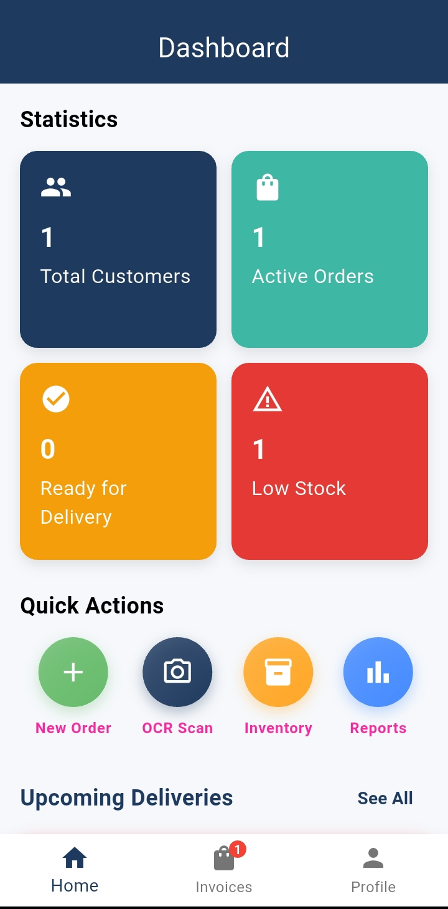
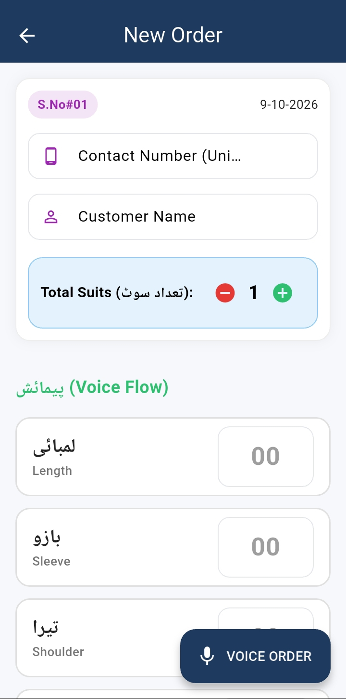
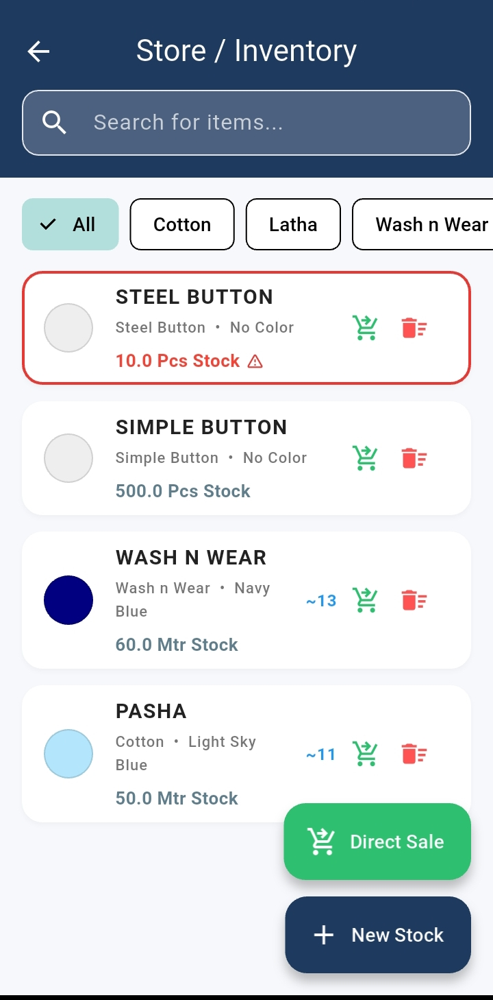
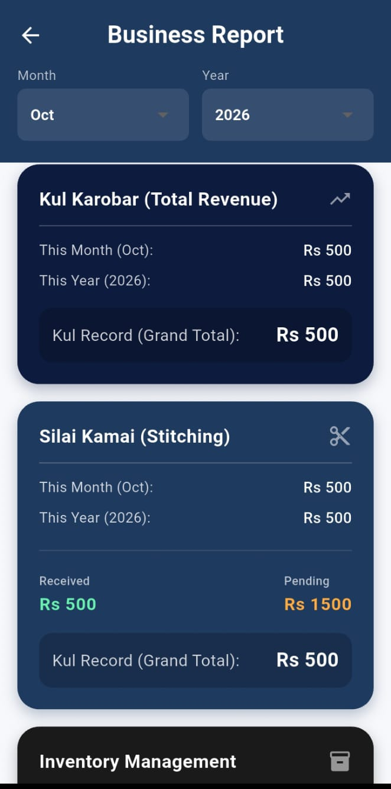

# 🧵 Smart Stitched AI

### AI-Powered Tailoring Management System

Smart Stitched AI is a Flutter-based mobile application designed to digitize and simplify the daily operations of local tailoring shops. It helps tailors manage customer measurements, stitching orders, fabric inventory, and business reports in one place.

The application integrates AI-powered features such as voice-to-text measurement entry, Optical Character Recognition (OCR) for handwritten records, and fabric color detection to improve efficiency and reduce manual work.

## ✨ Features

- **🎙️ Voice-to-Text Measurements:** Add customer measurements using voice input in Urdu and English.
- **📄 OCR for Handwritten Records:** Extract text from existing handwritten tailoring records using text recognition.
- **🎨 Fabric Color Detection:** Detect fabric colors using the device camera.
- **👥 Customer Management:** Store customer details and maintain measurement history.
- **📏 Measurement Management:** Save, view, and reuse customer measurements for repeat orders.
- **📋 Order Management:** Create and manage stitching orders with customer and measurement details.
- **🧵 Inventory Management:** Track fabric and button stock, monitor low-stock items, and record inventory sales.
- **🧾 Invoice Management:** Generate and manage order invoices and receipts.
- **📊 Business Reports:** View monthly and yearly revenue, stitching income, inventory income, and savings.
- **☁️ Cloud Database:** Store and manage application data using Firebase Cloud Firestore.

## 🛠️ Technologies Used

| Technology | Purpose |
|---|---|
| Flutter | Cross-platform mobile application development |
| Dart | Application programming language |
| Provider | State management |
| Firebase Cloud Firestore | Cloud database and data management |
| Speech-to-Text | Voice-based measurement entry |
| Flutter TTS | Spoken prompts and feedback |
| Google ML Kit Text Recognition | OCR and text extraction |
| SharedPreferences | Local preference storage |

## 📱 Application Modules

1. **Dashboard** — Access the main application features.
2. **Customer History** — View customer records and previous measurements.
3. **New Order** — Create stitching orders and enter measurements manually or by voice.
4. **OCR Scanner** — Recognize text from handwritten records.
5. **Inventory** — Manage fabric and button stock.
6. **Invoices** — Access order billing information and receipts.
7. **Reports** — Review business revenue and financial summaries.

## 🚀 Getting Started

### Prerequisites

Make sure you have the following installed:

- Flutter SDK
- Dart SDK
- Android Studio or Visual Studio Code
- Git
- A Firebase project configured for Cloud Firestore

### Installation

**1. Clone the repository**

```bash
git clone https://github.com/YOUR-USERNAME/smart-stitched-ai.git
```

**2. Navigate to the project directory**

```bash
cd smart-stitched-ai
```

**3. Install dependencies**

```bash
flutter pub get
```

**4. Configure Firebase**

Configure your Firebase project for the Flutter application and ensure that Cloud Firestore is enabled. Add the required Firebase configuration files and settings for your platform.

**5. Run the application**

```bash
flutter run
```

## 🏗️ Project Architecture

The application is developed using Flutter and follows a structured approach to separate screens, models, reusable widgets, and state management logic.

```text
lib/
├── models/
├── providers/
├── screens/
├── widgets/
└── main.dart
```

*Note: The directory structure above is illustrative. Adjust it to match the actual structure of your repository.*

## 🎯 Project Objectives

- Digitize traditional tailoring shop operations.
- Reduce manual effort in recording customer measurements.
- Make existing handwritten records easier to process.
- Improve customer and stitching order management.
- Maintain accurate inventory records.
- Provide useful business reports for better decision-making.

## 🔮 Future Enhancements

- Enhanced analytics and business insights.
- Improved voice recognition for tailoring-specific terminology.
- Additional inventory and billing features.
- Further improvements to OCR accuracy and fabric color detection.

## 🎓 Academic Project

**Project Name:** Smart Stitched AI  
**Project Type:** Final Year Project (FYP)  
**Degree:** Bachelor of Science in Computer Science (BSCS)  
**University:** Sarhad University of Science & Information Technology  
**Department:** Computer Science & IT  
**Session:** 2022–2026

## 👨‍💻 Developers

- **Muhammad Fareed**
- **Abdul Moiz**

## 📄 License

This project was developed for academic purposes. Add a suitable open-source license if you intend to permit others to use, modify, or distribute the source code.

---

⭐ If you find this project interesting, consider starring the repository on GitHub.

## 📸 Screenshots

### Dashboard


### New Order


### Inventory


### Reports

